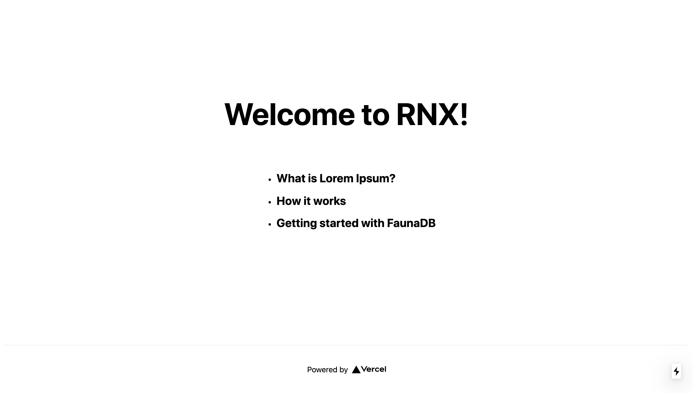

# RNX

RNX is a blog app with per-post multi-reaction system.

Built with [Next.js](https://nextjs.org/) and [FaunaDB](https://fauna.com/), and hosted on [Vercel](https://vercel.com/).

## Installation for local development

Clone this repository.

```bash
git clone https://github.com/mikeattara/rnx.git
```

Navigate to the project directory and install dependencies.

```bash
cd rnx & npm install
```

Start the development server

```bash
npm run dev
```

Learn more about [Learn Next.js](https://nextjs.org/learn).

## Author

You can connect with me

[Twitter](https://twitter.com/mikeattara)

[LinkedIn](https://www.linkedin.com/in/mikeattara)

[Email](mailto:mpyebattara@gmail.com)

## License

[MIT](https://choosealicense.com/licenses/mit/)
